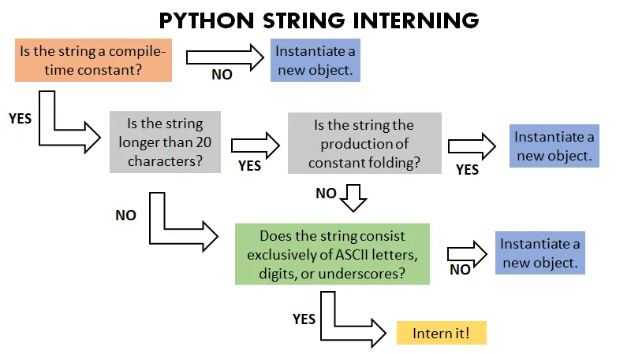

# String Interning

Read this article for more details: [String Interning in Python](https://medium.com/@bdov_/https-medium-com-bdov-python-objects-part-iii-string-interning-625d3c7319de)

- CPython stores strings as sequences of unicode characters.

- Unicode characters are stored with either 1, 2, or 4 bytes depending on the size of their encoding.
Byte size of strings increases proportionally with the size of its largest character, since all characters must be of the same size.

- To alleviate memory that can be quickly consumed by strings, Python implements string interning — aka. string storage.

- A string will be interned if it is a compile-time constant, is not the production of constant folding or is not longer than 20 characters, and consists exclusively of ASCII letters, digits, or underscores.
Empty strings are interned.

